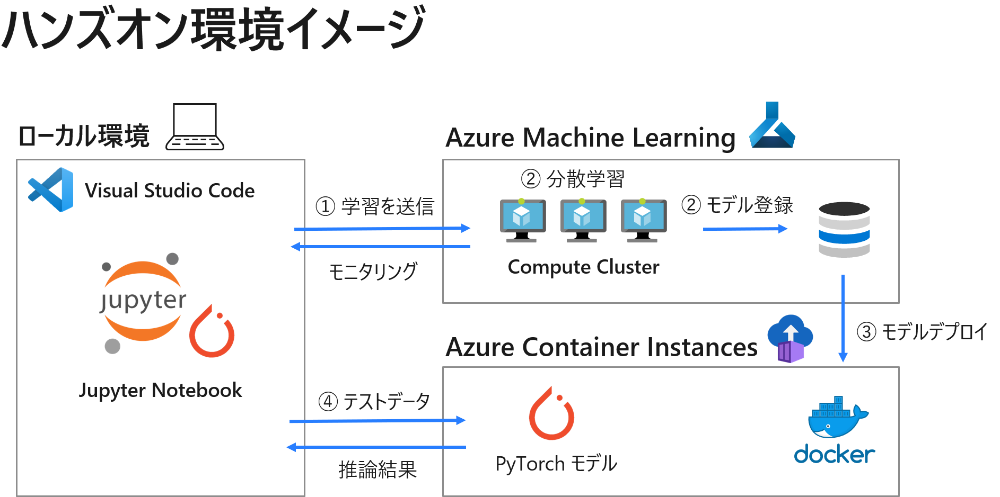

# Azure Machine Learningを使用したPyTorchモデルの分散深層学習

本コンテンツは、ローカルの Visual Studio Code (VSCode) 上から Azure Machine Learning を使用して PyTorch モデルの分散深層学習を行うハンズオンコンテンツです。

  

## 前提条件
本ハンズオンコンテンツでは下記環境を前提としています。
- [Anaconda](https://www.anaconda.com/products/individual)
- [Visual Studio Code (VSCode)](https://azure.microsoft.com/ja-jp/products/visual-studio-code/)
- [VSCode Python 拡張機能](https://marketplace.visualstudio.com/items?itemName=ms-python.python)
- [VSCode Jupyter 拡張機能](https://marketplace.visualstudio.com/items?itemName=ms-toolsai.jupyter)
- [Azure Machine Learning ワークスペース作成](https://docs.microsoft.com/ja-jp/azure/machine-learning/how-to-manage-workspace?tabs=azure-portal)

## 実行手順
### 環境準備
`./setup.ipnb`を実行します。

### Azure MLでの学習とデプロイ (メインコンテンツ)
`./examples/distributed-pytorch-with-distributeddataparallel.ipynb`を実行します。

## 参考情報
- [VSCode の Azure ML 拡張機能チュートリアル](https://docs.microsoft.com/ja-jp/azure/machine-learning/tutorial-setup-vscode-extension)
- [Azure Machine Learning を使用して PyTorch モデルを大規模にトレーニングする](https://docs.microsoft.com/ja-jp/azure/machine-learning/how-to-train-pytorch#distributeddataparallel)
- Horovod を使用した分散深層学習を行うサンプルノードブック
[Distributed PyTorch with Horovod](https://github.com/Azure/MachineLearningNotebooks/blob/master/how-to-use-azureml/ml-frameworks/pytorch/distributed-pytorch-with-horovod/distributed-pytorch-with-horovod.ipynb)
    ※本コンテンツでは分散学習を行うためにPyTorch の DistributedDataParallel 機能を使用しています。

### 関連ノートブック
- モデル学習部分の
[Distributed PyTorch with DistributedDataParallel](https://github.com/Azure/MachineLearningNotebooks/blob/master/how-to-use-azureml/ml-frameworks/pytorch/distributed-pytorch-with-distributeddataparallel/distributed-pytorch-with-distributeddataparallel.ipynb)
- モデルデプロイ部分
[Train, hyperparameter tune, and deploy with PyTorch](https://github.com/Azure/MachineLearningNotebooks/blob/master/how-to-use-azureml/ml-frameworks/pytorch/train-hyperparameter-tune-deploy-with-pytorch/train-hyperparameter-tune-deploy-with-pytorch.ipynb)
